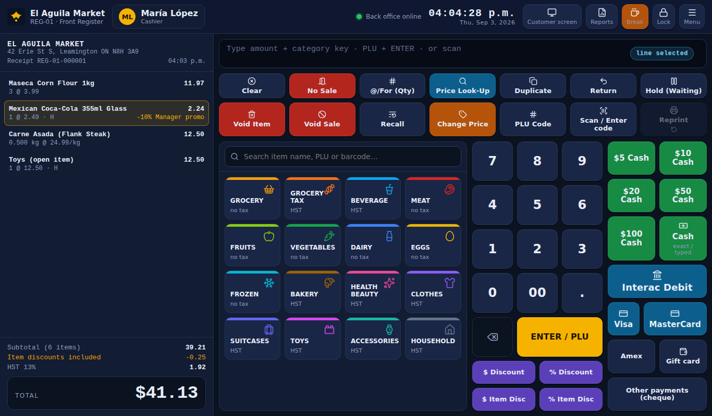

# El Aguila Register (aguilaPOSregister)

Touch-first point-of-sale register for **El Aguila Market**, built to replace the current
BESTPOS screen while keeping the workflow the associates already know: the same department keys
(Grocery, Grocery Tax, Beverage, Meat, Fruits, Vegetables, Dairy, Eggs, Frozen, Bakery,
Health & Beauty, Clothes, Suitcases, Toys, Accessories, Household), *amount + department* for open
items, quick cash keys ($5 … $100), Interac / Visa / MasterCard, @/For, price look-up, hold/recall,
void, return, discounts and PLU entry.

Every action is recorded and streamed to the manager's back office
([aguilaPOS](https://github.com/Innovatiff/aguilaPOS)). When an associate goes on **break**, the
register closes their segment and sends a full **closing report**; ending the shift sends the Z report
with the drawer count.



## Highlights

* **PIN sign-in & shifts** — opening float, breaks (segment reports), end-of-shift blind drawer count
  with over/short, lock/unlock, supervisor/manager approvals with PIN for voids, discounts,
  price changes and paid-outs.
* **Selling** — department tiles and item tiles, search, PLU + ENTER, open-department items,
  quantities (@/For), weighed items (kg), duplicate last, hold & recall ("Waiting"), returns,
  item and sale discounts with reasons, price overrides with reasons, void item / void sale.
* **Scanning** — USB keyboard-wedge scanners work out of the box: UPC-A / EAN-13 with check-digit
  validation, produce PLU stickers (4046 avocado…), and deli-scale **price-embedded labels**
  (type-2 UPC) that compute the weight automatically. Unknown codes are logged for the manager.
* **Payments** — cash with change, Interac debit, Visa, MasterCard, Amex, gift card, cheque, split
  tenders; a semi-integrated **payment terminal flow** (simulated for the demo, ready for
  Moneris / Global Payments) with terminal request/response logged.
* **Customer display** — `/customer` route for the second monitor: items, totals, "please follow
  the terminal", change due, thank-you screen, promotions when idle (BroadcastChannel, no server).
* **Receipts** — 80 mm thermal layout with HST breakdown, reprint (logged), print via the browser
  print dialog (thermal driver in production).
* **Ontario HST** — basic groceries, produce, meat, dairy and eggs zero-rated; snacks, single-serve
  drinks, single bakery items and merchandise taxed at 13%; tax follows the department unless the
  product overrides it.
* **Offline-first** — 7-day local journal, event queue that syncs every 3 seconds, catalog and staff
  pulled from the back office (bundled copy as fallback), heartbeat with register status.
* **Reports on the register** — live X report of the current segment, today's transactions with
  reprint, closed shifts.

More screenshots in [`docs/screenshots`](docs/screenshots).

## Run it

Requirements: Node.js 20+ (tested on 22). Start the back office first (`aguilaPOS`, port 4000).

```bash
npm install
npm run dev        # http://localhost:5173  (register)   http://localhost:5173/customer (2nd screen)
```

```bash
npm run build && npm run preview   # production build on :5173
npm test                           # 13 unit tests: tax engine, cart, barcodes, closing report
```

The register works without the back office too (bundled catalog and demo PINs); events queue until
the server is reachable. Settings → *Back office connection* to change the API URL, register ID or
device key.

## Deploy

The register is a static site. `netlify.toml` is included: import the repo in Netlify, set
`VITE_API_BASE_URL` to the back-office API URL and deploy. Details in
[`docs/DEPLOY.md`](docs/DEPLOY.md).

## Demo PINs

Cashiers: María **1234**, José **2468**, Ana **1357**, Carlos **4321** · Supervisor Luis **5150** ·
Manager **9999** (approvals).

## Hardware

See [`docs/HARDWARE.md`](docs/HARDWARE.md) — scanner, deli scale labels, payment terminal, customer
display, receipt printer and cash drawer, and the built-in *hardware test bench* (Settings) that
simulates scans, scale labels and terminal responses for demos.

## Project layout

```
src/core        pure business logic (types, money, HST, cart, barcodes, closing report, events) + tests
src/state       zustand stores (settings, catalog, session, journal, cart, ui) and pos.ts (all operations)
src/sync        API client, offline event queue, bootstrap/heartbeat/catalog refresh
src/hardware    scanner (keyboard wedge), payment terminal, customer display, printer, sounds
src/components  register UI (status bar, receipt, function keys, catalog grid, keypad, tenders, modals)
src/pages       login/lock, register, customer display, settings & test bench, reports, about
src/data        bundled catalog (16 departments, 184 products), store info, demo employees
```

---
Built by Innovatiff · Aguila POS Suite 1.0.0 (demo)
